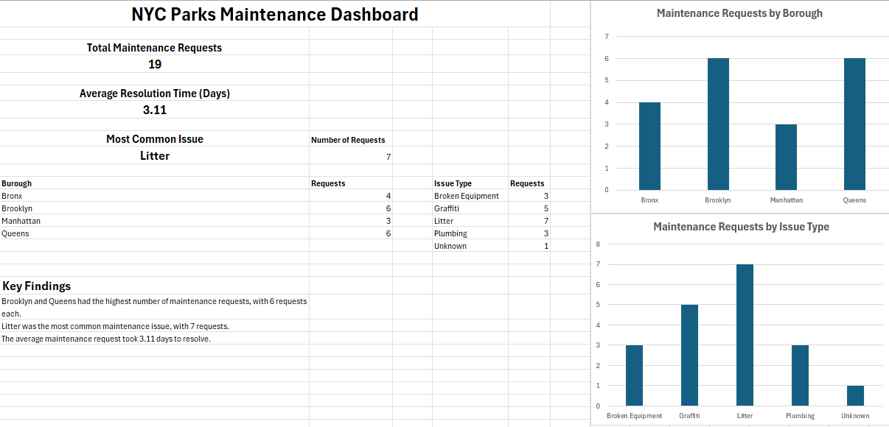

# NYC-Parks-Operations-Analysis
Project Overview

This project analyzes a sample dataset of NYC Parks maintenance requests using Microsoft Excel. The goal was to identify patterns in maintenance issues, borough activity, facility types, and resolution times.

The project demonstrates a basic data analytics workflow, including data cleaning, analysis, visualization, and communicating findings.

Tools Used
Microsoft Excel
PivotTables
PivotCharts
COUNTIF
COUNTIFS
AVERAGE
AVERAGEIF
MAX and MIN
Data cleaning
Data visualization
Dataset

The dataset contains 19 sample maintenance requests with information including:

Request ID
Borough
Facility Type
Issue Type
Month
Resolution Days

Note: This is a practice dataset created for learning purposes and is not presented as official NYC Parks data.

Analysis

The analysis examined:

Number of maintenance requests by borough
Number of requests by issue type
Average resolution time
Average resolution time by facility type
Maintenance issues across different boroughs
Key Findings
Brooklyn and Queens had the highest number of maintenance requests, with 6 requests each.
Litter was the most common maintenance issue, with 7 requests.
Recreation Center requests had the longest average resolution time at 4.75 days.
The overall average resolution time was 3.11 days.
Dashboard

The Excel workbook includes an interactive-style dashboard containing:

Total maintenance requests
Average resolution time
Most common issue
Maintenance requests by borough
Maintenance requests by issue type
Key findings
Project Structure

This project demonstrates foundational skills in:

Data cleaning
Data analysis
Excel formulas
Data summarization
PivotTables
Data visualization
Dashboard development
Communicating analytical findings

